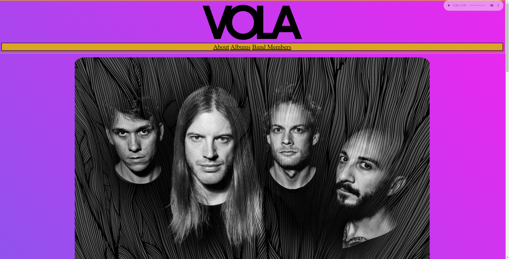
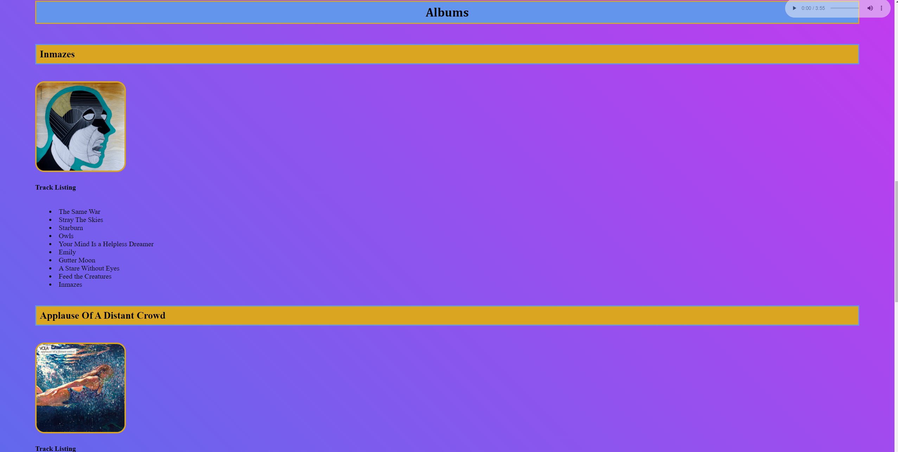
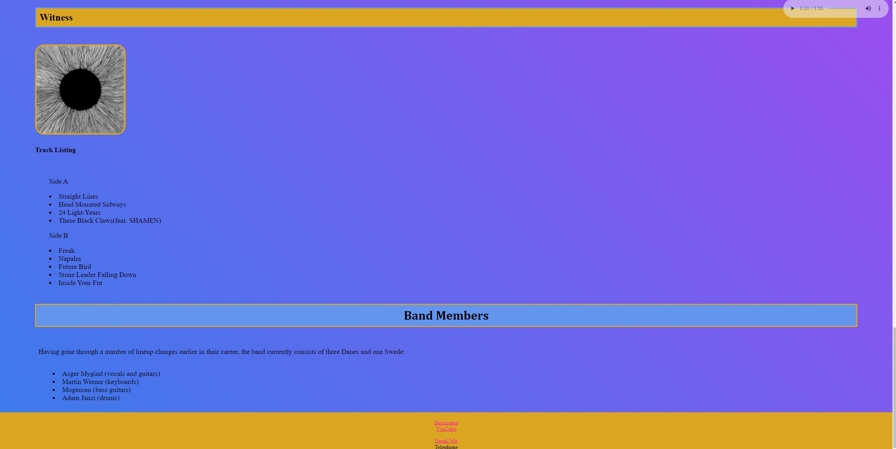

# About my-first-webpage
This project began as attempt to make a simple fan page for one of my favorite bands, VOLA. I was brand new to HTML and CSS and wanted to work on a personal project to practice what I was learning. 

## Project Goals
**This webpage will display information about one of my favorite bands, VOLA.**
The goal of the page is simply to display text and images, have some minor navigational capabilities, and allow a user to access the band's social platforms through functioning links.

## Technology and Tools
* HTML
* CSS

## Page Preview

## About Me
I am currently a student of the Thinkful Engineering Immersion program.
